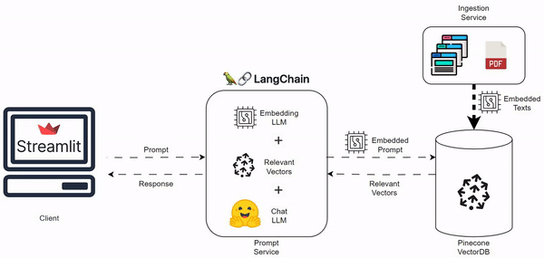

# Local-GPT🚀

Local-GPT let's you host your LLM locally. This GGUF format is suitable for CPU usage. The CPU version is slower but still usable. 
It's a great way to handle sensitive data, free to use and allows offline access.

## Architecture

## Components

### Streamlit(main.py) 🖥️
Streamlit helps to create a simple chat UI. It's easy to use and customizable. In the streamlit app, the chat_history is stored so the context from previous chat are used to generate future response. 

### Ingestion Service(ingestion.py) 🍴
The ingestion service can ingest various types of documents into the PineCone index. The document is first embedded into vectors using the embedding_llm, and then stored in PineCone. In the sample code, a pdf document and a few websites are scraped as HTML and stored in PineCone. This documents serves as up-to-date knowledgebase which the LLM might not be aware of. This updated knowledge is used as context to generate response by the prompt service.

### Prompt Service(prompt.py) 📜
There are 3 components in the prompt service that are linked together by LangChain.
1) embedding_llm
2) chat_llm
3) pinecone connection

The prompt from user is first embedded by embedding_llm and passed to the pinecone to retrieve the relevant documents. The relevant documents are passed back to prompt service as additional knowledge. This knowledge, together with user's prompt are used by chat_llm to generate the response.

💬 Chat LLM used: ([zephyr-7b-beta.Q4_K_M.gguf](https://huggingface.co/TheBloke/zephyr-7B-beta-GGUF/tree/main))
💻 Embedding LLM used: ([all-MiniLM-L6-v2](https://huggingface.co/sentence-transformers/all-MiniLM-L6-v2))

## Local-GPT demo 🎮
<picture>
  <source srcset="https://fonts.gstatic.com/s/e/notoemoji/latest/1f3cf/512.webp" type="image/webp">
  
</picture>

### Search finance news
This news article are scraped from news websites during ingestion. The source of information will be included in the response so that users can verify.

### Chat history information retained
The chat history is stored in the streamlit app. This allows the LLM to generate response based on the context from previous chat.

